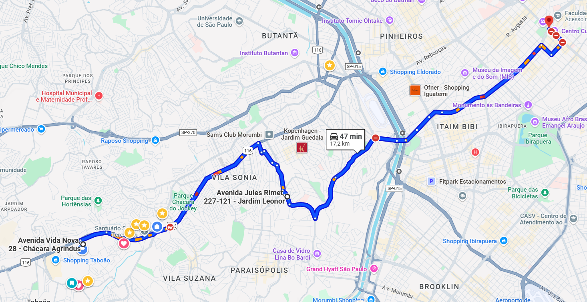
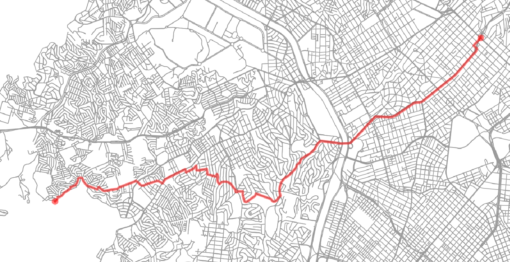

# IA Map - Cálculo de Rotas Inteligente

Um projeto de **cálculo de rotas eficiente**, feito em **Python**, voltado para **motoboys, entregadores e sistemas de otimização logística**.

O sistema é baseado em **OpenStreetMap (OSM)** e permite calcular trajetos entre múltiplos pontos com diferentes algoritmos, como **A\*** e **Dijkstra**, podendo ser usado tanto em **APIs** quanto em **aplicativos desktop**.

---

## Imagens





## Estrutura do Projeto

ia-map-unifecaf-python/

│

├── src/

│ ├── lib/

│ │ ├── init.py

│ │ ├── ai_map_osm.py # Biblioteca principal de cálculo de rotas

│ │ └── geo_utils.py # Biblioteca auxiliar

│ │

│ ├── main/

│ └─ ── main.py # Exemplo de uso da biblioteca

│

├── README.md

└── requirements.txt

---

## Exemplo de Saída

```
[+] Baixando mapa de São Paulo, Brazil ...
[✓] Mapa carregado com sucesso.
[→] Calculando rota para 3 pontos ...
[→] Calculando rota de (-23.609903123319242, -46.768615411386975) até (-23.59930295301864, -46.71912465622006) ...
[✓] Rota encontrada (6.7 km)
 Trecho 1: 6.7 km

[→] Calculando rota de (-23.59930295301864, -46.71912465622006) até (-23.562091773212586, -46.65563820973811) ...
[✓] Rota encontrada (8.79 km)
 Trecho 2: 8.79 km

Distância total: 15.49 km
Número total de nós: 180
```

---

## Tecnologias

OSMnx — carregamento de mapas via OpenStreetMap

NetworkX — cálculo de caminhos (A*, Dijkstra, etc)

Matplotlib — visualização de rotas

Licença
Este projeto é de uso educacional e faz parte de um trabalho acadêmico da Unifecaf.


---
